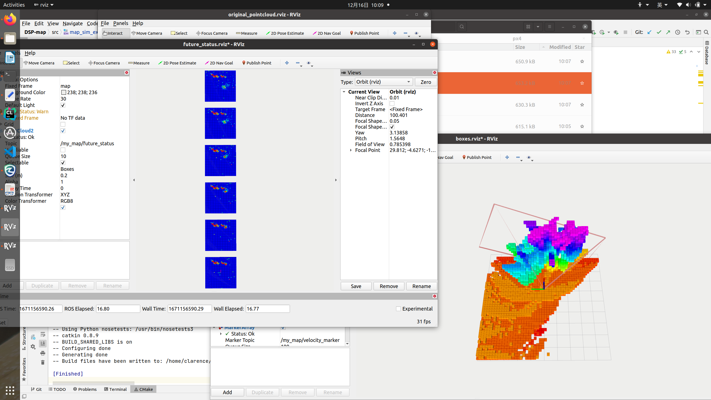
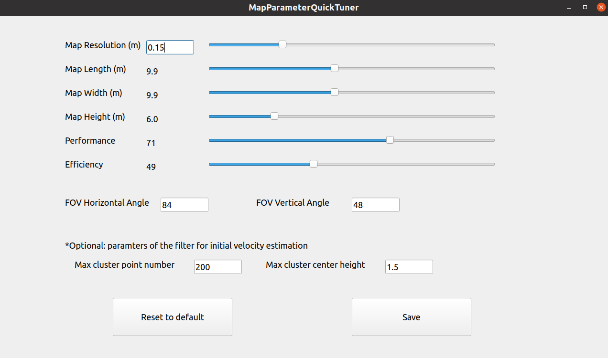

# Description
This repository contains the head files of the Dual-Structure Particle-based (DSP) map
and a ROS node example to use this map. For more information about the DSP map, see [video](https://www.youtube.com/watch?v=seF_Oy4YbXo&t=5s) and [preprint](https://arxiv.org/abs/2202.06273).

There are three __head files__ in the `include` folder.
1. ``dsp_dynamic.h`` is the head file for the DSP map with a constant velocity model (called DSP-Dynamic map in our paper). (__Recommended__ for Type II dynamic occupancy map.)
2. ``dsp_dynamic_multiple_neighbors.h`` is the head file for the DSP map with a constant velocity model. Check the Supplementary section below to know the difference between `dsp_dynamic` and `dsp_dynamic_multiple_neighbors`.
3. ``dsp_static.h`` is the head file for the DSP map with the static model (called DSP-Static map in our paper). (Type I dynamic occupancy map.)

Just include one of the head files in your source file and use the map. We write everything in a single head!

A ROS __node example__ `map_sim_example.cpp` can be found in the `src` folder. In the example, we subscribe point cloud from topic `/camera_front/depth/points` and pose from `/mavros/local_position/pose` to build the map. We publish the current occupancy status with topic `/my_map/cloud_ob` and one layer of the predicted future occupancy maps with topic `/my_map/future_status` in the point cloud form.

# Compile
__Tested environment__: Ubuntu 18.04 + ROS Melodic and Ubuntu 20.04 + ROS Noetic

To compile the source code of our map, you need:
1. PCL and Mavros. PCL is included in the desktop-full version of ROS.
   Mavros is only used for ROS message subscriptions in the example node. Check [mavros](https://github.com/mavlink/mavros) for installation guidance.

2. Install [munkers-cpp](https://github.com/saebyn/munkres-cpp) with the following steps.
    ```
    git clone https://github.com/saebyn/munkres-cpp.git
    cd munkres-cpp
    mkdir build && cd build
    cmake ..
    make
    sudo make install
    ```

3. Download and compile the example node
    ```
    mkdir -p map_ws/src
    cd map_ws/src
    git clone https://github.com/g-ch/DSP-map.git
    cd ..
    catkin_make
    ```

# Test
Download a bag file named `street.bag` containing the point cloud and pose data collected with a drone in Gazebo. [Download](https://drive.google.com/file/d/1go4ALTe8CqaBY2wjZJzkUCmdlBI7yAAU/view?usp=sharing).
Save the bag file in `data` folder.

Launch a test by
```
cd map_ws
source devel/setup.bash
roslaunch dynamic_occpuancy_map mapping.launch
```

The launch file will start the example mapping node and open three RVIZ windows to show the current occupancy status (3D), predicted future occupancy status (2D, layer of a height set in `map_sim_example.cpp`), and the raw point cloud from the camera.



# Parameters
There are quite a few parameters in this map. Below we provide two ways to set the parameters.

__NOTE:__ Only Parameter `Camera FOV`, including a horizontal angle and a vertical angle of the FOV, is coupled with hardware and should be set according to the real FOV of your camera.
You can use default values for other parameters.

## Set Parameters with a Tool
Some of the parameters are hard to understand if you are not very familiar with the DSP map. We provide a "Parameter Tuner" tool to set the parameters in the DSP-Dynamic map in an easily-understood way. To use the tool, open the `script` folder and run 

```
python set_map_parameters.py
```
You will see the following UI.



The meaning of parameters in the UI are:

1. _Map Resolution_ controls the size of the voxel subspace in the map. The voxel subspace is used to voxelize the map for visulaization and usage in voxel-based motion planners. Changing this parameter will change voxel resolution. (When _Map Resolution_ is changed, the tool will also change the occupancy threshold in `map_sim_example.cpp` to a nice value automatically.) 

2. _Map Length/Width/Height_ control the size of the map. The mapping process gets slower when the size gets larger.
   
3. _Performance/Efficiency_ control the performance level and efficiency level of the map, respectively. Improving the performance will lower the efficiency.

4. _FOV Horizontal/Vertical Angle_ describe the FOV range of the camera. Set the parameters according to the real FOV size of your depth camera. Since the depth points close to the edge of the FOV are usually very noisy, the tool will clip the FOV size a little bit after the parameters are saved.

5. _(Optional) Max cluster point number / center height_ are parameters in the initial velocity estimator. The initial velocity estimator clusters the input point cloud. The cluster whose size is larger than `Max cluster point number` or center height is larger than `Max cluster enter height` will be regarded as a cluster representing static obstacles.

Press the `Save` button to save parameters. Some parameters in `map_sim_example.cpp` and `dsp_dynamic.h` will be changed accordingly. Then you need to recompile the code with `catkin_make`.

Press the `Reset to default` button to show the default parameters. Then press the `Save` button to use the default parameters.


## Set Parameters in the Code Directly
You can also modify the parameters in the code directly. For DSP-Static map and DSP-Dynamic map using multiple neighbors, you can only use this way currently.

### Static parameters
The following parameters can be found at the top of the map head file.
1. Camera FOV. It is necessary to set the camera FOV angle for your camera. The unit is degree and we set the half-angle value.
    ```
    const int half_fov_h = 45;  // Half of the horizental angle. should be able to be divided by ANGLE_RESOLUTION. If not, modify ANGLE_RESOLUTION or make half_fov_h a little smaller value than the real FOV angle
    const int half_fov_v = 27;  // Half of the vertical angle. Should be able to be divided by ANGLE_RESOLUTION. If not, modify ANGLE_RESOLUTION or make half_fov_h a little smaller value than the real FOV angle
    ```
* The ``ANGLE_RESOLUTION`` is 3 in the head files. Don't change ``ANGLE_RESOLUTION`` unless you are very familiar with the way our map works.
* Tips: Depth camera usually contains large noise near the edge of the image. You can make the FOV parameter a little smaller than the real FOV angle. But never make it larger.

2. Change the size and resolution of the map by changing the following parameters:
    ```
    #define MAP_LENGTH_VOXEL_NUM 66
    #define MAP_WIDTH_VOXEL_NUM 66
    #define MAP_HEIGHT_VOXEL_NUM 40
    #define VOXEL_RESOLUTION 0.15
    ```
* The default resolution is `0.15m`. The real size of the Map length is `MAP_LENGTH_VOXEL_NUM * VOXEL_RESOLUTION`.
* With different resolutions, you also need to change the threshold in Function "getOccupancyMapWithFutureStatus" in the ROS node.

  __Note:__ Although the DSP map is continuous and composed of particles. We usually acquire the current or future occupancy status from the voxel structure. The voxel resolution is theoretically arbitrary but you need to tune the parameter for threshold and maximum particle number if the resolution is changed.
  To maintain the same efficiency when the resolution changes (the real map size is the same), the maximum particle number in the map shouldn't change, which means you need to change the maximum number of particles in each voxel space by changing the Parameter `MAX_PARTICLE_NUM_VOXEL`.


3. Change the time stamp to predict the future status
    ```
    #define PREDICTION_TIMES 6
    static const float prediction_future_time[PREDICTION_TIMES] = {0.05f, 0.2f, 0.5f, 1.f, 1.5f, 2.f}; //unit: second
    ```

### Dynamic parameters
The following parameters can be changed dynamically in the node.
```
my_map.setPredictionVariance(0.05, 0.05); // StdDev for prediction. velocity StdDev, position StdDev, respectively.
my_map.setObservationStdDev(0.1); // StdDev for update. position StdDev.
my_map.setNewBornParticleNumberofEachPoint(20); // Number of new particles generated from one measurement point.
my_map.setNewBornParticleWeight(0.0001); // Initial weight of particles.
DSPMap::setOriginalVoxelFilterResolution(res); // Resolution of the voxel filter used for point cloud pre-process.
```

# Record Particles
In our ROS node, we publish point cloud from occupancy status. The particles are not published because they are too many.
But you can record the particles at one time to a CSV file for analysis.

```
my_map.setParticleRecordFlag(1, 19.2); // Uncomment this to save particle file of a moment. Saving will take a long time. Don't use it in real-time applications.
```

You can use the Matlab app tool ``app1.mlapp`` in the `display` folder to open the CSV and view and analyze the particles.

# Citation
If you use our code in your research, please cite
```
@article{chen2022continuous,
  title={Continuous Occupancy Mapping in Dynamic Environments Using Particles},
  author={Chen, Gang and Dong, Wei and Peng, Peng and Alonso-Mora, Javier and Zhu, Xiangyang},
  journal={arXiv preprint arXiv:2202.06273},
  year={2022}
}
```

# License
MIT license.

# Supplementary
* __Difference between `dsp_dynamic` and `dsp_dynamic_multiple_neighbors`__:
  In `dsp_dynamic.h`, Parameter ANGLE_RESOLUTION (3 degrees) is not as small as the real sensor angle resolution (may be smaller than 1 degree). This is not ideal to handle occlusion when very tiny obstacles exist but is efficient and sufficient in most scenarios.
  In `dsp_dynamic_multiple_neighbors`, Parameter ANGLE_RESOLUTION can be as small as the real sensor angle resolution. A (2*PYRAMID_NEIGHBOR_N+1)^2 neighborhood pyramid space will be considered in the update. This is ideal to handle occlusion when very tiny obstacles exist but is less efficient.

* __Difference between Type I and Type II dynamic occupancy map__: The type I map considers only to model the current status of dynamic obstacles. Type II considers short-term prediction of the future status of dynamic obstacles.


